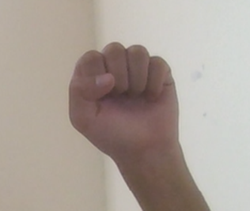
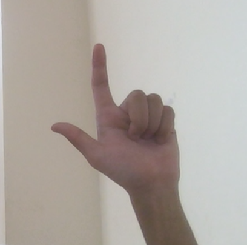
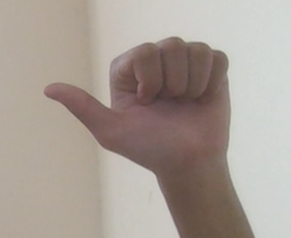
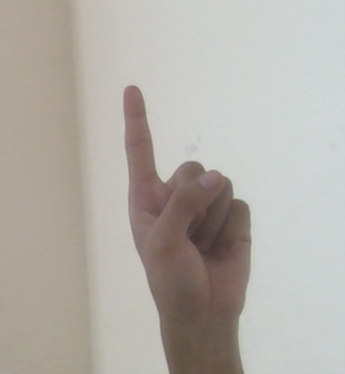
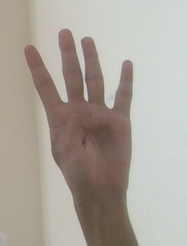
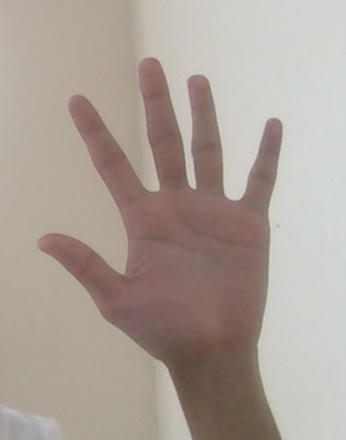

1. Change directory to "Final_Model" folder
2. Run: pip install -r requirements.txt
3. Run: "Hand_gesture_with_mouse.py"

Define Hand gesture
1. Move mouse: 
-----------------------------------------------
2. Double left click mouse: 
-----------------------------------------------
3. Left click mouse: 
-----------------------------------------------
4. Right click mouse: 
-----------------------------------------------
5. Scroll mouse: 
-----------------------------------------------
6. Long press mouse: 

